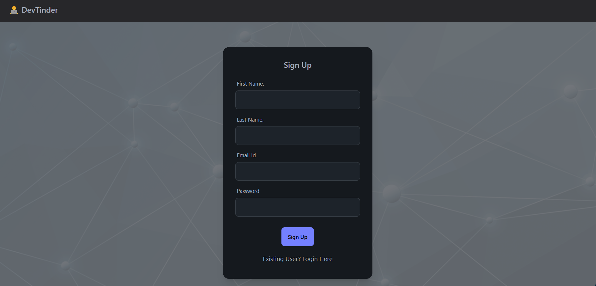
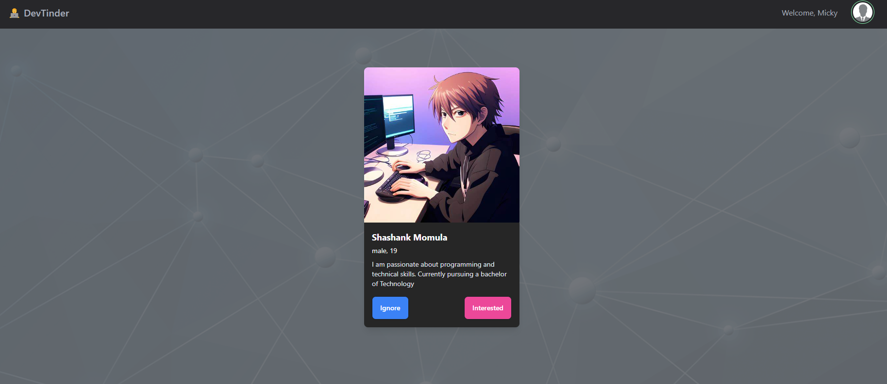

# **DevTinder**  
A full-stack MERN application that connects developers by enabling user authentication, profile management, and dynamic feed functionalities with scalable APIs.

## **Features**  
### **Authentication & User Management**  
- User registration, login, and logout with **JWT-based authentication**.  
- Edit user profile and manage session securely.

### **Developer Connections**  
- Send and manage connection requests (accept, reject, or ignore).  
- View and explore developer connections dynamically.

### **Dynamic Feed**  
- Built a **paginated feed API** for scalable and real-time content delivery.  
- Efficient state management using **Redux Toolkit**.

### **Backend API**  
- RESTful APIs built with **Express.js**, including routes for:  
  - User authentication
  - Profile editing
  - Connection requests
  - Feed management

### **Database Management**  
- Utilized **MongoDB** for efficient user data storage and relationship modeling using **Mongoose**.

### **Frontend**  
- Built with **React (Vite bundler)** for optimized performance and a responsive user experience.  
- Integrated **Tailwind CSS** for sleek and modern UI design.

---

## **Tech Stack**  
- **Frontend:** React, Tailwind CSS, Redux Toolkit  
- **Backend:** Node.js, Express.js  
- **Database:** MongoDB  
- **Authentication:** JWT (JSON Web Token)  

---

## **Installation**  
### Prerequisites  
- Node.js (v16 or above)  
- MongoDB (Local or Cloud instance)  

### **Steps to Run Locally**  
1. **Clone the Repository**  
   ```bash
   git clone https://github.com/yourusername/devTinder.git
   cd devTinder
   ```

2. **Install Dependencies**  
   For backend:  
   ```bash
   cd backend
   npm install
   ```  
   For frontend:  
   ```bash
   cd frontend
   npm install
   ```
---


## **APIs Overview**  
### **Authentication**  
- `POST /login`  
- `POST /signup`  
- `POST /logout`

### **Profile Management**  
- `GET /profile/view`  
- `PATCH /profile/edit`

### **Connections**  
- `POST /request/send/interested/ID`  
- `POST /request/review/accepted/ID` 
- `GET /user/request/received`
- `GET /user/connections`

### **Feed**  
- `GET /feed?page=1&limit=10`

---
## Screenshots

### Login Page


### User Profile Page


### Dynamic Feed



## **Future Enhancements**  
- Add real-time notifications using WebSockets.  
- Implement advanced search and filtering options for developer connections.  
- Add analytics for user engagement.

---

## **Contributing**  
Feel free to contribute! Fork the repository and submit a pull request with your features or bug fixes.  

---

## **Contact**  
For any queries or feedback, please reach out at:  
**Email:** shashankmomula11@gmail.com  

---
